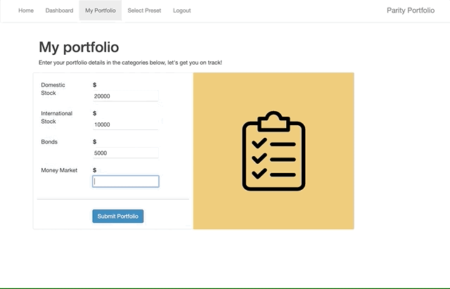

# ParityPortfolio
Rebalance Your Portfolio

- [Heroku Link](https://parity-portfolio.herokuapp.com/)
- [Video Demo](https://youtu.be/XSBdlFVdDJA)
- [Devpost Submission](https://devpost.com/software/parity-portfolio#updates)

# Setup Enviroment
- Install Python 3
- Install pip
- pip install -r requirements.txt

# Setup SQLAlchemy & SQLite
- Navigate to project folder
- In Python interpreter: from main import db
- Setup User table: from main import User
- Setup Portfolio table: from main import Portfolio
- Setup SavedPreset table: from main import SavedPreset

# Run App
- Navigate to root of project folder  
- python3 main.py

# Navigate App
- Navigate to http://127.0.0.1:5000/
- Create a new account and log in
- Enter personal portfolio information
- Select preset portfolio option

